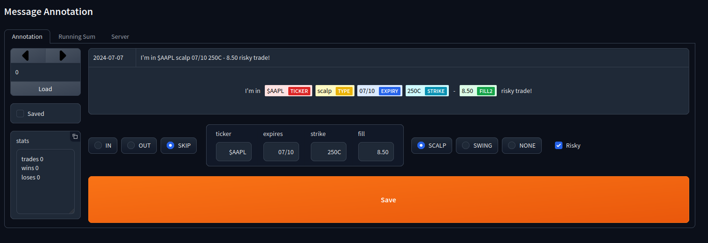

## Stonks Annotator

Imagine you're tracking a stock market guru, and you want to accurately assess their profitability.  
They share their trades on Discord, so you download the entire channel history.  
However, before you can visualize these trades, you must parse and clean the data to make it compatible with your plotting algorithm.

This script was developed to assist in manually parsing and previewing the raw messages efficiently.

